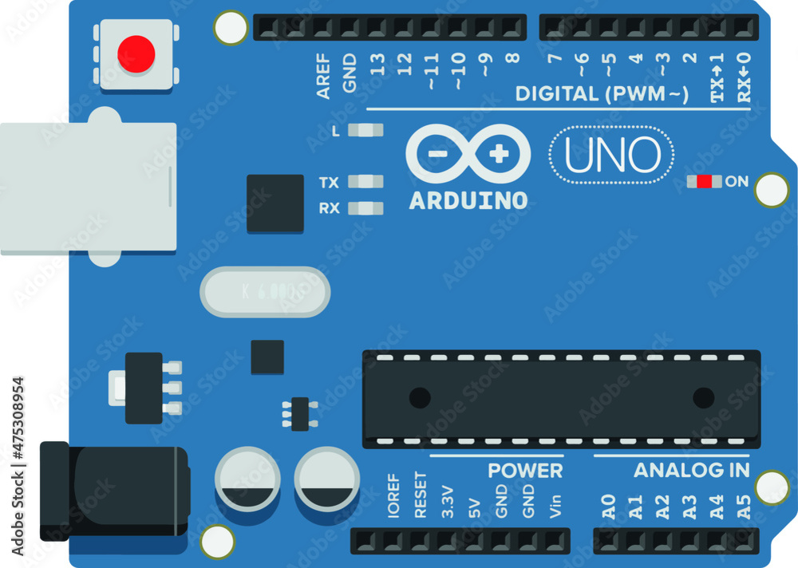
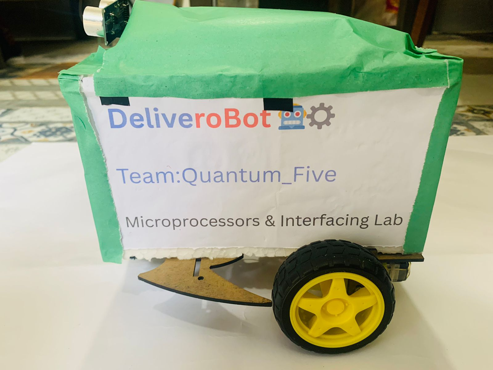
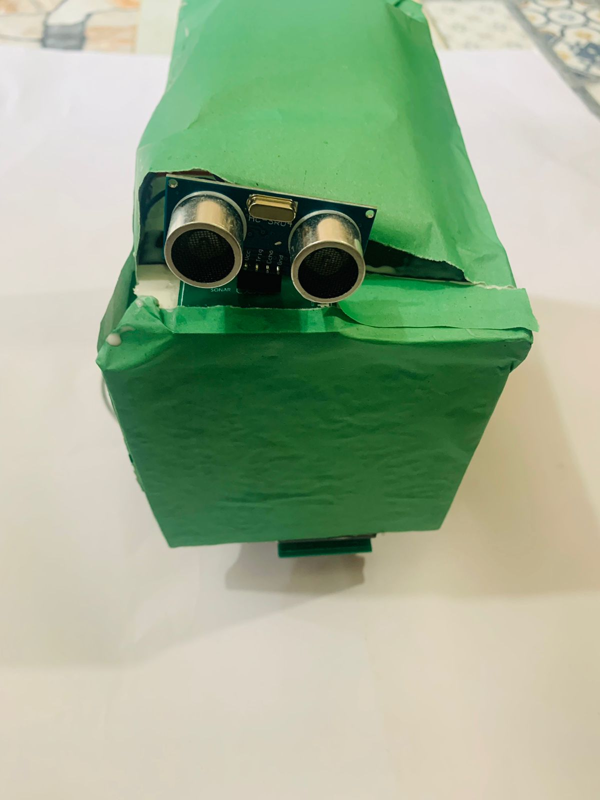
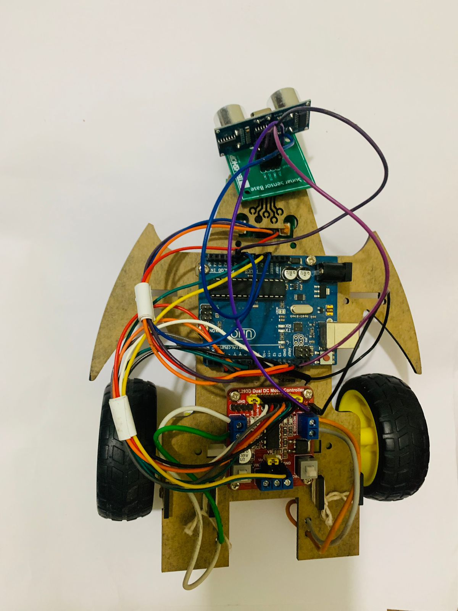

# Delivery-Robot-Arduino-Project 

## DELIVERY ROBOT

---

## Abstract
Automation is transforming service-based industries by enabling faster and more consistent task execution. This project focuses on developing a compact Arduino-based delivery robot designed for small indoor environments such as restaurants. The robot follows a marked path using IR sensors and uses an ultrasonic sensor to detect and avoid obstacles. Powered by DC motors and a lightweight control system, it aims to transport small loads safely and reliably. The goal is to produce an affordable, practical prototype that showcases how autonomous delivery mechanisms can reduce human workload and improve service efficiency.

---

## Key Terms
- [Introduction](#introduction)
- [Related Work](#related-work)
- [Proposed Solution](#proposed-solution)
- [Aim and Objectives for the Proposed Solution](#aim-and-objectives-for-the-proposed-solution)
- [Hardware Requirements](#hardware-requirements)
- [Software Requirements](#software-requirements)
- [The Delivery Robot](#the-delivery-robot)
- [Demonstration of our project](#demonstration-of-our-project)
- [Robot Construction and Arduino and other connections](#robot-construction-and-arduino-and-other-connections)
- [Cost Estimation](#cost-estimation)
- [Conclusion](#conclusion)
- [References](#references)
- [Authors](#authors)

---

## Introduction
Technological advancements have encouraged industries to shift from manual operations to automated systems. Restaurants, in particular, still depend heavily on workers for short-range food delivery, which often results in delays, human error, and increased operational expense. The rise of social distancing concerns during the COVID-19 period highlighted the need for contactless service options, especially in crowded environments.

Autonomous robots provide a promising alternative by performing repetitive tasks with precision and without fatigue. Our project explores the construction of such a robot—one capable of navigating a predefined path independently and reliably. By integrating sensors and microcontroller logic, the robot is designed to perform indoor food delivery while demonstrating how automation can enhance efficiency in everyday service environments.

---

## Related Work
The development of automated food delivery robots was still in its early stages of commercialization 2-3 years back. However, after the COVID-19 pandemic, its popularity and importance have significantly increased. In 2021, the market size of intelligent food delivery systems in China reached $600 million. By 2026, it is expected to reach $3.2 billion. Even though the market for this system is increasing for large-scale businesses, the use of such automated systems is not very common in root-level businesses, especially in a country like Bangladesh. Existing systems have undergone several stages of development and testing but still lack the feasibility required to incorporate them into medium to high-budget businesses in our country. Our project aims to eliminate the existing gap in the use of such technology and make it available to the masses by providing a cost-effective solution within our available limited resources.

---

## Proposed Solution
To address the need for a low-cost autonomous delivery mechanism, we propose a robot built around the Arduino Uno platform. The robot’s navigation is guided through a line-tracking system composed of multiple IR sensors that continuously monitor the underlying surface. It uses a pair of DC motors controlled through an L293D motor driver for movement, while an ultrasonic sensor provides real-time detection of obstacles in its path.

The internal logic is programmed to interpret sensor inputs and adjust the robot’s motion using conditional motor control. This setup allows the robot to follow predefined routes with minimal deviation and to stop or slow down when necessary. By combining modular hardware components with an adaptable control program, the proposed solution aims to deliver a functional and cost-efficient prototype suitable for indoor delivery applications.

---

## Aim and Objectives for the Proposed Solution

The proposed solution focuses on developing a functional and efficient autonomous delivery robot. The key objectives are:

Design and Development: Create a well-defined path layout for the robot and develop the required software logic to enable autonomous movement along that path.

Navigation and Control: Implement mapping and path-following techniques to ensure accurate positioning. Develop a control mechanism that interprets sensor data and provides real-time movement instructions to the robot.

Obstacle Response: Build a responsive system using sensors that can detect obstacles ahead and adjust the robot’s movement to avoid collisions.

Cost Effectiveness: Perform a cost-benefit evaluation to determine whether deploying delivery robots offers a more economical solution compared to traditional human-based delivery systems.

General Use Cases: Ensure that the robot can be used across multiple environments such as restaurants, hospitals with flat floors, warehouses, and supershops. Since it is a line-following system, it can be applied to any indoor environment requiring small to medium-scale object delivery.

---

## Hardware Requirements

1.Arduino UNO
A microcontroller board based on the ATmega328P, featuring 14 digital I/O pins, 6 analog inputs, a 16 MHz ceramic resonator, USB interface, power jack, ICSP header, and a reset button.

2.IR Sensor
Detects infrared light to identify the black/white contrast on the track. Adjustable range sensors will be used for precise line detection.

3.Motor Driver
A DC motor driver module (such as L293D or L298N) used to control the direction and speed of the motors.

4.BO Motor
A lightweight geared DC motor (3–12V) suitable for small robotic platforms and ideal for line-following applications.

5.Wheels
Wheels attached to the BO motors to provide movement and ensure smooth mobility along the track.

6.Lithium-ion Battery
Rechargeable power source capable of supplying stable voltage for long operational periods.

7.Jumper Cables
Connecting wires used to link sensors, motors, and modules with the Arduino board.

8.Sonar Sensor (Ultrasonic Sensor)
Uses ultrasonic pulses and their echoes to measure distance and detect obstacles in the robot’s path.

---

## Software Requirements
We need the Arduino IDE software for the project. We will write custom programs according to the project's requirements.

---

## The Delivery Robot

---

# Robot Construction and Arduino and other connections.

<table>
  <caption><strong> L293D Motor Driver and Arduino : </strong></caption>
  <tr>
    <th>L293D Pin</th>
    <th>Arduino UNO R3 Pin</th>
    <th>Remarks</th>
  </tr>
  <tr>
    <td>ENA</td>
    <td>10</td>
    <td>Left motor’s speed control</td>
  </tr>
  <tr>
    <td>ENB</td>
    <td>11</td>
    <td>Right motor’s speed control</td>
  </tr>
  <tr>
    <td>IN1</td>
    <td>2</td>
    <td>Forward/backward motion of left motor</td>
  </tr>
  <tr>
    <td>IN2</td>
    <td>3</td>
    <td>Forward/backward motion of left motor</td>
  </tr>
  <tr>
    <td>IN3</td>
    <td>4</td>
    <td>Forward/backward motion of right motor</td>
  </tr>
  <tr>
    <td>IN4</td>
    <td>5</td>
    <td>Forward/backward motion of right motor</td>
  </tr>
  <tr>
    <td>Vin</td>
    <td>Vin</td>
    <td>Motor’s Power</td>
  </tr>
  <tr>
    <td>GND</td>
    <td>GND</td>
    <td>All grounds should be connected</td>
  </tr>
</table>

---

<table>
  <caption><strong> Digital IR Sensor Array2 (TCRT5000)</strong></caption>
  <tr>
    <th>IR Sensor Array2 Pin</th>
    <th>Arduino UNO R3 Pin</th>
    <th>Remarks</th>
  </tr>
  <tr>
    <td>VCC</td>
    <td>5V</td>
    <td>Sensor power</td>
  </tr>
  <tr>
    <td>GND</td>
    <td>GND</td>
    <td>All grounds should be connected</td>
  </tr>
  <tr>
    <td>SEN1</td>
    <td>12</td>
    <td>Left sensor</td>
  </tr>
  <tr>
    <td>SEN2</td>
    <td>13</td>
    <td>Right sensor</td>
  </tr>
</table>

---

<table>
  <caption><strong>Arduino to HC SR-04 Ultrasonic Distance Sensor</strong></caption>
  <tr>
    <th>Arduino Pin</th>
    <th>HC SR-04 Pin</th>
  </tr>
  <tr>
    <td>A0</td>
    <td>Trig</td>
  </tr>
  <tr>
    <td>A1</td>
    <td>Echo</td>
  </tr>
  <tr>
    <td>5V</td>
    <td>Vcc</td>
  </tr>
  <tr>
    <td>GND</td>
    <td>GND</td>
  </tr>
</table>

## Cost Estimation
Our initial estimation is approximately BDT 6000 - 12,000 for the prototype. We have included cost-effective items in the list of requirements.

---

## Conclusion
The completed prototype demonstrates how simple electronics and microcontroller programming can create an effective indoor delivery robot. Through accurate path tracking and basic obstacle handling, the robot succeeds in performing its assigned delivery tasks with reliability. While currently designed for small loads and predefined routes, the system can be enhanced with more sensors, wireless communication, and dynamic navigation algorithms.

This project showcases how an affordable automation solution can reduce operational burdens in restaurants and similar environments. With further development, such delivery robots can contribute to safer, more efficient, and technologically advanced service infrastructures.

---

## References
1. Dr. Manjula V, Ms. Jaishri Ramakrishnan, Anandu Thambikuttan, Ashiq Mohamed Shajahan, Ampady. C.R. . ‘Smart Delivery Robot using Arduino’, International Journal of Research Publication and Reviews, Vol 3, Issue 6, pp 4546-4549, June 2022.
2. Samak Devavrat, Dinesh Salunke. ‘Development of a non-humanoid robot for hospitality’; AIP Conference Proceedings 2653, 020006 (2022); https://doi.org/10.1063/5.0110542
3. J. Chandrashekhara, Divya M. S, Shivaprasad M S. ‘Food Serving Robot for Contactless Experience’, International Journal of Innovative Research in Computer Science & Technology (IJIRCST) ISSN: 2347-5552, Volume-10, Issue-3, May 2022 https://doi.org/10.55524/ijircst.2022.10.3.11 Article ID IRP1265, Pages 58-61 www.ijircst.org
4. https://www.linkedin.com/pulse/current-state-development-food-delivery-robots-%E6%B7%B1%E5%9C%B3%E5%B8%82%E9%94%90%E6%9B%BC%E6%99%BA%E8%83%BD%E8%A3%85%E5%A4%87%E6%9C%89%E9%99%90%E5%85%AC%E5%8F%B8/
5. https://docs.arduino.cc/hardware/uno-rev3/

## Authors
- **Md. Shuvo Khan ** (Registration No: 2021331069)
- **Nehal Hasnain Alve ** (Registration No: 2021331061)
- **Shamim Hossain ** (Registration No: 2021331071)
- **Sakib Al Hridoy ** (Registration No: 2021331005)
- **Santosh Saha ** (Registration No: 2021331091)

---
